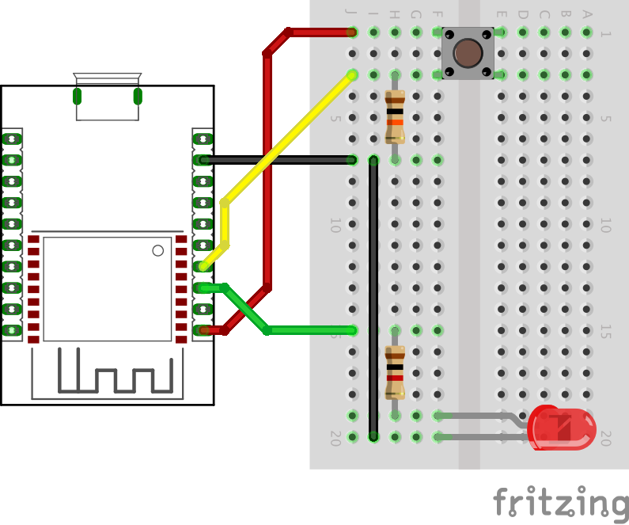

# Prototyping IoT Applications with ESP8266 and IFTTT

## Required Materials

* [ ] [ESP-WROOM-02 development board (with pin sockets)](https://www.switch-science.com/catalog/2652/): 1
* [ ] USB cable (A to Micro B): 1
* [ ] Breadboard: 1
* [ ] Jumper wires: as much as is sufficient
* [ ] Tactile switch: 1
* [ ] 10k Ohm resistor: 1
* [ ] LED: 1
* [ ] 1k Ohm resistor: 1

## Setting up your Environment for ESP8266

1. Install [Arduino 1.6.9](https://www.arduino.cc/en/Main/Software) from the Arduino website.
2. Start Arduino and open Preferences window (**File** > **Preferences** on Windows, **Arduino** > **Preferences...** on Mac OS X).
3. Enter http://arduino.esp8266.com/stable/package_esp8266com_index.json into **Additional Board Manager URLs** field.
4. Hit OK. Then navigate to the Board Manager by going to **Tools** > **Boards** > **Boards Manager**. Look for esp8266. Click on that entry, then select Install.
5. With the Board addon installed, all that’s left to do is select ‘Generic ESP8266 Module’ from **the Tools** > **Boards** menu.
6. Change the **Reset Method** in the **Tools** menu from **ck** (default) to **nodemcu**
7. Navigate to **Library Manager** by going **Sketch** > **Include Library** > **Manage Libraries...**
8. Look for PubSubClient. Click on that entry, then select Install.
9. Look for ArduinoJson. Click on that entry, then select Install.
10. Congratulations, your environment is now ready to play with ESP8266!

## Test your Environment (with your ESP-WROOM-02 development board)

1. Connect a button, a LED, two resistors (10k ohm and 1k ohm) and jumper wires on your breadboard as shown in the diagram  
   
2. Install [the FTDI VCP driver](http://www.ftdichip.com/Drivers/VCP.htm) if needed
  * Windows 7, 8 or 10: install
  * MacOS 10.9 (Mavericks) and 10.10 (Yosemite): install and disable the Apple-provided driver by entering commands as follows  
    `$ cd /System/Library/Extensions/IOUSBFamily.kext/Contents/Plugins`  
    `$ sudo mv AppleUSBFTDI.kext AppleUSBFTDI.disabled`  
    `$ sudo touch /System/Library/Extensions`
  * MacOS 10.11 (El Capitan): **DON'T** install
3. Select your serial port number under the **Tools** > **Port** menu (e.g. COM3 on Windows, /dev/cu.usbmodem1234 on MacOS).
4. Navigate **File** > **Examples** > **02.Digital** > **Button**
5. Replace `buttonPin = 2` with `buttonPin = 12`, then `ledPin = 13` with `ledPin = 14`
6. Hit the **Upload** button on your Arduino IDE to start uploading
7. If you see the LED is on while you are pressing the button, that means you finished setting up the circuit successfully!
8. Navigate **File** > **Examples** > **ESP8266WiFi** (as a part of Examples from Custom Libraries) > **WiFiClientBasic**
9. Replace `SSID` and `passpasspass` in the 16th line with yours (e.g. `WiFiMulti.addAP("my_ssid", "my_pass");`)
10. Open a **Serial Monitor** by going **Tools** > **Serial Monitor**
11. Change the baud rate from 9600 bps (default) to 115200 bps
12. Hit the Upload button on your Arduino IDE to start uploading (**on Windows, please keep closing the Serial Monitor while uploading, or uploaded code might be corrupted**)
13. If you see and IP address, that means your ESP8266 is connected to your WiFi network successfully!

## How ESP8266 Is Different from Arduino Uno?

* A Wi-Fi (802.11 b/g/n) wireless modem is integrated
* The processor is faster and has much memory space
* 3.3V, instead of 5V
* Limited number of pins
* Some pins (i.e. D0) are used for special functions
* Only one analog input (i.e. A0) and range is 0 - 1V, instead of 0 - 5V

## Example #1: ESP8266 as a Trigger Device

1. Point your web browser to https://ifttt.com/maker to connect the Maker channel to your account
2. Copy your key and paste it to your notebook
3. Create a recipe; choose the Maker channel for the trigger (Event Name should be 'ping') and choose something (e.g. IF Notifications) for the action
4. Open IFTTT_Trigger
5. Navigate to a tab named 'config.h' and replace the SSID, password and key with your's
6. Upload the example to the board, hit the button and see what happens on your smartphone

## Example #2: ESP8266 as an Action Device

1. Point your web browser to https://beebotte.com/ and create an account
2. Create a Channel (e.g. ifttt) and a Resource (e.g. action)
3. Copy the Channel Token and paste it to your notebook
4. Create a recipe; choose something (e.g. Instagram) as the trigger and choose the Maker channel for the action, and configure as follows:
  * URL: https://api.beebotte.com/v1/data/write/ifttt/action?token=**********
  * Method: Post
  * Content Type: application/json
  * Body: `{"data":"{{UserName}}"}`
5. Open IFTTT_Action_Beebotte
6. Navigate to a tab named 'config.h' and replace the SSID, password and key
7. Upload the example to the board
8. Provoke the trigger and see what happens

## Let’s Try!

* Create an example to fire a trigger when your indoor brightness changes (e.g. from bright to dark); How might we convert the voltage range from 0 - 3.3V to 0 - 1V, to fit the range of the analog input pin of your board? (see IFTTT_Trigger_Analog)
* Write a code to move a servo motor when something happened (e.g. a person posted a Tweet); How might we connect a servo motor to your board and control it?

## Resources

* [Arduino core for ESP8266 WiFi chip](https://github.com/esp8266/Arduino)
* [MQTT (MQ Telemetry Transport)](http://mqtt.org/)
* [Arduino Client for MQTT](http://pubsubclient.knolleary.net/)

## Related Toolkits

* [Blynk](http://www.blynk.cc/)
* [Node-RED](http://nodered.org/)
